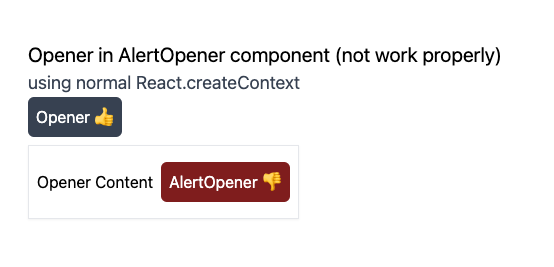
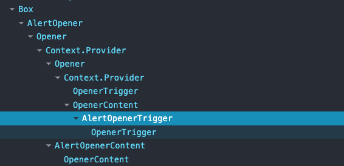

# practice-complex-context

Practice for React context when using nested contexts.

## why

최근에 UI 컴포넌트를 만드는 경험을 많이 했습니다. 주로 headless 컴포넌트 라이브러리를 가져와 개발을 많이 했었는데, 리액트 Context API를 사용하는 케이스가 많았습니다.
Props Drilling을 피하고, 리액트 트리 내 Context를 공유하는 것이 더 효율적이라고 생각했기 때문일 것 같습니다. 리액트는 peer로 설정해두기에 별도 전역 상태 관리 라이브러리를 사용하지 않고도 리액트 Context API를 사용하면서 상태를 공유할 수 있기 때문이기도 했습니다.

그러던 와중에 복잡한 컴포넌트들을 개발하게 되면서 리액트 Context API를 사용하는 도중 예기치 않은 문제가 발생했습니다. 그 얘기와 관련되어 이 글과 Practice 코드를 작성하게 되었습니다.

## issue

컴포넌트(간단하게 `A` 컴포넌트라고 지칭하겠습니다)를 재사용한 또 다른 컴포넌트(`B` 컴포넌트)를 만들면서 동일 Context를 사용하게 되었는데, Context가 의도한 대로 동작하지 않았습니다.
다시 말해서, consumer에서 의도한 Context를 가져오지 못하는 문제가 발생했습니다.

예를 들어, `children`을 트리거를 통해 자식 컴포넌트를 보여주거나 숨기는 간단한 컴포넌트(`<Opener />`)가 있습니다.

```tsx
interface OpenerContextValue {
  open: boolean;
  setOpen: React.Dispatch<React.SetStateAction<boolean>>;
}
// Opener Context
const OpenerContext = React.createContext<OpenerContextValue | null>(null);

// Opener
function Opener({ children }: OpenerProps) {
  const [open, setOpen] = React.useState(false);

  return (
    <OpenerContext.Provider value={{ open, setOpen }}>
      <div>{children}</div>
    </OpenerContext.Provider>
  );
}
```

Compound 컴포넌트 형태로 `<OpenerTrigger />`와 `<OpenerContent />` 컴포넌트를 만들어 보겠습니다.

`<OpenerTrigger />`와 `<OpenerContent />` 컴포넌트(consumer)에서는 `React.useContext`를 이용하여 `OpenerContext`를 사용할 수 있습니다.

```tsx
function OpenerTrigger({ children }: OpenerProps) {
  const { setOpen } = React.useContext(OpenerContext);

  return <button onClick={() => setOpen((prev) => !prev)}>{children}</button>;
}

function OpenerContent({ children }: OpenerContentProps) {
  const { open } = React.useContext(OpenerContext);

  if (!open) {
    return null;
  }

  return <div>{children}</div>;
}
```

`<Opener />` 컴포넌트는 문제없이 동작합니다.

```tsx
function App() {
  return (
    <Opener>
      <OpenerTrigger>Open</OpenerTrigger>
      <OpenerContent>Content</OpenerContent>
    </Opener>
  );
}
```

그러나 만약 여러 중첩된 컴포넌트에서 `<Opener />`를 사용하게 된다면, `<Opener />` 컴포넌트를 사용하는 컴포넌트의 Context가 `<Opener />` 컴포넌트의 Context를 덮어쓰게 됩니다.

**[Consumer는 가장 가까운 Provider의 Context를 가져오게 되는데, 중첩되고 복잡한 컴포넌트 트리에서는 의도하지 않은 Context를 가져오게 될 수 있습니다.](https://beta.reactjs.org/reference/react/useContext#passing-data-deeply-into-the-tree)**

좀 더 구체적으로 예를 들어보겠습니다.

`<Opener />`를 사용하여 `<AlertOpener />` 컴포넌트를 만들어 보겠습니다.

```tsx
interface AlertOpenerProps extends React.ComponentProps<typeof Opener.Root> {}
function AlertOpener(props: AlertOpenerProps) {
  return <Opener.Root {...props} />;
}

interface AlertOpenerTriggerProps extends React.ComponentProps<typeof Opener.Trigger> {}
function AlertOpenerTrigger({ className, ...props }: AlertOpenerTriggerProps) {
  return <Opener.Trigger {...props} className={cn('bg-red-900', className)} />;
}

interface AlertOpenerContentProps extends React.ComponentProps<typeof Opener.Content> {}
function AlertOpenerContent({ className, ...props }: AlertOpenerContentProps) {
  return <Opener.Content {...props} className={cn('bg-red-500 text-white', className)} />;
}
```

마찬가지로 `<AlertOpener />`는 단독으로 사용 시 문제없이 정상 동작합니다.

```tsx
function App() {
  return (
    <AlertOpener>
      <AlertOpenerTrigger>Open</AlertOpenerTrigger>
      <AlertOpenerContent>Content</AlertOpenerContent>
    </AlertOpener>
  );
}
```

만약 `<AlertOpener />` 컴포넌트 내에서 `<Opener />` 컴포넌트를 다음과 같이 사용할 경우는 어떻게 될까요?

```tsx
function App() {
  return (
    <AlertOpener>
      <Opener>
        <OpenerTrigger>Opener Open</OpenerTrigger>
        <OpenerContent>
          Opener Content
          <AlertOpenerTrigger>AlertOpener Open</AlertOpenerTrigger>
          <AlertOpenerContent>AlertOpener Content</AlertOpenerContent>
        </OpenerContent>
      </Opener>
    </AlertOpener>
  );
}
```



렌더링은 문제 없이 동작합니다. 그러나 `AlertOpenerTrigger`를 클릭하면 의도했던 `AlertOpenerContent`가 렌더링되는 대신 `OpenerContent`가 닫히게 됩니다.

그 이유는 컴포넌트 트리에서 볼 수 있습니다.



`AlertOpenerTrigger` 위치를 코드에서 보게 되면 가장 가까운 Context Provider는
`<AlertOpener />`에서 사용된 Provider가 아닌 `<Opener />`에서 제공되는 Provider입니다.

코드를 풀어서 보면 조금 더 이해하기 쉬울 것 같습니다.

```tsx
function App() {
  return (
    <OpenerContext.Provider>
      {/* AlertOpener의 Provider */}
      <div>
        <OpenerContext.Provider>
          {/* Opener의 Provider */}
          <div>
            <button>Opener Open</button> {/* Opener의 Trigger */}
            <div>
              {/* Opener의 Content */}
              Opener Content
              <button>AlertOpener Open</button> {/* AlertOpener의 Trigger */}
              <div>AlertOpener Content</div> {/* AlertOpener의 Content */}
            </div>
          </div>
        </OpenerContext.Provider>
      </div>
    </OpenerContext.Provider>
  );
}
```

위에서 말한 `consumer는 가장 가까운 Provider의 Context를 가져온다`는 원칙에 따라 `<AlertOpenerTrigger />`는 가장 가까운 `<Opener />`에서 제공되는 Context를 가져오게 됩니다.
따라서 `AlertOpenerTrigger`를 클릭하면 `AlertOpenerContent`가 렌더링되는 대신 `OpenerContent`가 닫히게 됩니다.

이런 구조를 사용해야 하는 경우라면 어떻게 해결을 해야할까요?

## solution 1. brute-force

쉬운 접근법은 `<AlertOpener />`의 Context를 `<Opener />`의 Context로 덮어쓰는 것입니다.  
즉, `<Opener />` 트리 상위에 동일 Context가 존재한다면 그 Context를 사용하도록 만드는 것입니다.

```tsx
interface OpenerContextValue {
  open: boolean;
  setOpen: React.Dispatch<React.SetStateAction<boolean>>;
}

const createOpenerContext = () => React.createContext<OpenerContextValue | null>(null);

function Opener({ className, DefaultContext = createOpenerContext() }: OpenerProps) {
  const [open, setOpen] = React.useState(false);

  return (
    <DefaultContext.Provider value={{ open, setOpen }}>
      <div>{children}</div>
    </DefaultContext.Provider>
  );
}
```

`<Opener />`는 props로 `DefaultContext`를 받습니다. 만약 `DefaultContext`가 존재한다면 그 Context를 사용하고, 존재하지 않는다면 그 때 `OpenerContext`를 만들어 사용하도록 했습니다.
`<Opener />`를 사용하여 확장한 컴포넌트에서는 `createOpenerContext`를 이용하여 Context를 만들어 `DefaultContext`로 넘겨주면 됩니다.

위 issue 예시를 해결하기 위해서 `<AlertOpener />`는 다음과 같은 코드가 나올 것입니다.

```tsx
const AlertOpenerContext = Opener.createOpenerContext();

interface AlertOpenerProps extends React.ComponentProps<typeof Opener.Root> {}

function AlertOpener(props: AlertOpenerProps) {
  return <Opener.Root {...props} DefaultContext={AlertOpenerContext} />;
}

interface AlertOpenerTriggerProps extends React.ComponentProps<typeof Opener.Trigger> {}

function AlertOpenerTrigger(props: AlertOpenerTriggerProps) {
  return <Opener.Trigger {...props} DefaultContext={AlertOpenerContext} />;
}

interface AlertOpenerContentProps extends React.ComponentProps<typeof Opener.Content> {}

function AlertOpenerContent(props: AlertOpenerContentProps) {
  return <Opener.Content {...props} DefaultContext={AlertOpenerContext} />;
}
```

이처럼 간단하게 얽힌 Context 문제는 해결할 순 있지만 복잡하게 중첩된 Context를 사용하는 경우에는 코드가 매우 복잡해질 것입니다.
그래서 좀 더 나은 방법을 찾아보았습니다.

## solution 2. Context Scope

radix-ui에서는 이러한 _중첩 동일 Context내에서 의도한 Context 가져오기_ 의 해결방법으로 context scope를 사용하여 해결하고 있습니다.
